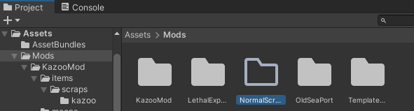
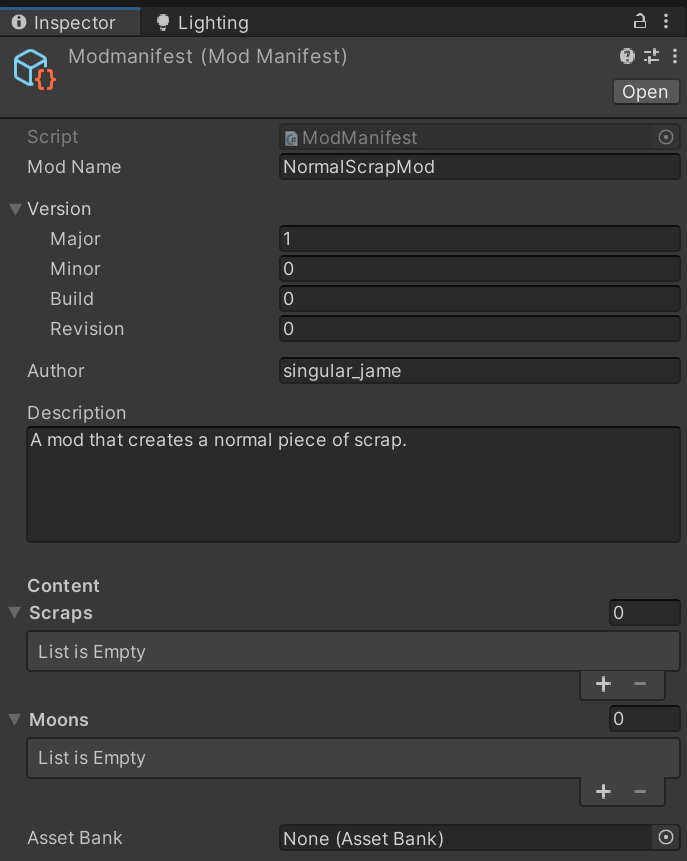
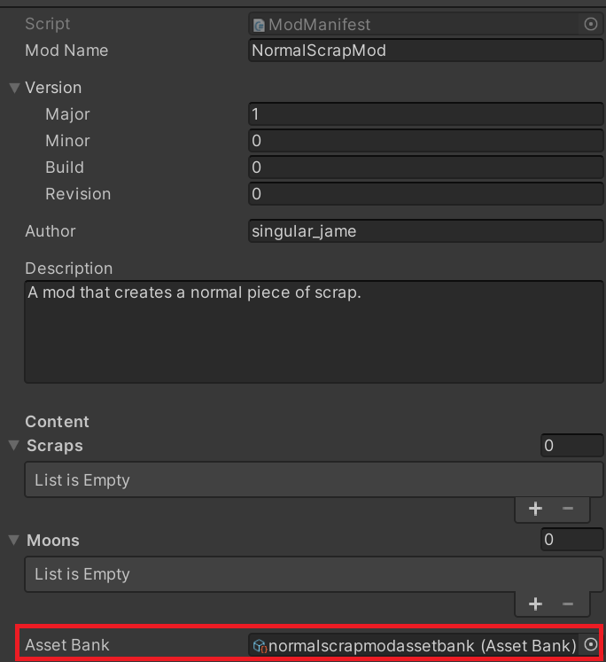

# Initial Mod Setup
The first step to making any assets that you want to have LethalExpansion load into the game is to set up some scripts that will help LethalExpansion identify your mod.

First, let's create a new folder in the `Assets/Mods` directory of the project. For example, here I have created a new folder named `NormalScrapMod`.

Inside that folder, we are going to create a `Mod Manifest` file, which will let LethalExpansion know what scrap and moons it should include in the game when your mod loads.

To do this, enter the folder we have just created and create a `Mod Manifest` asset by right clicking inside the folder and selecting `Create->LethalSDK->Mod Manifest`. Make sure to name the `Mod Manifest` *exactly* `modmanifest`, otherwise LethalExpansion will not load it.

Now we can configure the mod manifest to work for our mod. For this step, set the mod name to the name of the folder you made earlier, set the `Major` version to `1`, and fill out the author and description fields. Don't worry about the `Scraps` and `Moons` fields for now, as we'll come back to those later.

> [!NOTE]
> The mod name **must** exactly match the folder that you have created in order for LethalSDK to bundle everything properly.

Next we will create the `Asset Bank` file, which lets LethalExpansion know what resources to reference if you have custom sounds/moons/networked objects.

To do this, right click in this folder and select `Create->LethalSDK->Asset Bank`. Make sure to name is similarly to how we named the mod manifest for consistency, in this case, I have named it `normalscrapmodassetbank`. Now we just have to set this reference in our `Mod Manifest` asset, which we can do by selecting the mod manifest and dragging our `Asset Bank` asset into the reference field.

Now our mod is pretty much set up, so before we make any new scrap or moons, it might be helpful to create some new folders to keep everything organized.

Following the template mod, we can create two new folder structures, that being `items/scraps` and `moons`.

If you've done everything correctly, your project structure should look something like this:

After verifying your project looks something like this, you are now ready to move on to any of the scrap or moon examples:

## Scrap Guides
- Scrap Type
  - [Normal](./ScrapGuides/NormalScrapType.md)
  - Shovel - TODO
  - Flashlight - TODO
  - Noisemaker - TODO
  - WhoopieCushion - TODO

## Moon Guides
- TODO