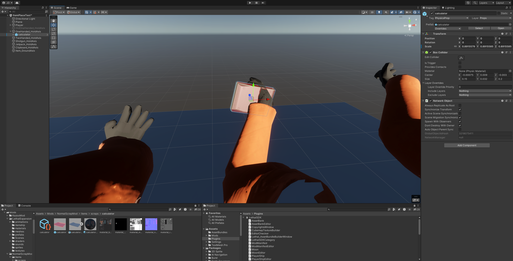

# Normal Scrap Type Guide
This is the guide for the creation of a new piece of scrap using the `Normal` type, which just means the player can pick it up and sell it as scrap.

This guide assumes you have followed the [Mod Setup](../ModSetup.md) guide or you already have a valid project set up.

## 1. Model Import

The asset I will be using will be this [calculator](https://sketchfab.com/3d-models/calculator-citizen-lowpoly-2b8011e5346d4f61a01ff1d9c3eaa3f2) I found on SketchFab. Make sure to download it as the `fbx` option.

To begin, I will first create a new folder in our `items/scraps` directory called `calculator`.

Once that folder is created, we can import our assets, which we can do by unzipping the downloaded file, going into the `source` directory, and copying the `Calculator_Citizen.fbx` file into our newly created folder. You should also copy all of the texture files in the `textures` directory to our newly created folder.

Your project should look something like this now:


## 2. Material Setup

Now we will set up the material for the calculator so the textures can be displayed properly.

Create a new material by right clicking and following `Create->Material`, then name it something like `CalculatorMaterial` or whatever makes the most sense to you.

Now we need to assign the textures in the material. With the material selected, click the small lock icon as this will make texture assignment a little easier.

Now we will assign the textures, simply drag the texture labeled `material_base_color.png` into the small box next to the `Base Map` field, the cursor should change when you hover over the small box.

Then assign the normal map (the purple looking file) to the `Normal Map` field. We'll only assign these two for the sake of simplicity, since the High Definition Render Pipeline can't by default accept the metallic, roughness, and ambient occlusion maps as they are currently. If you want to learn more about this, follow this [link](https://docs.unity3d.com/Packages/com.unity.render-pipelines.high-definition@12.0/manual/Lit-Shader.html) (the term you want to search for is 'channel packing').

> [!NOTE]
> In order for the normal map to show properly, you need to click on it (make sure you've unlocked the inspector tab) and set the `Texture Type` to `Normal map`.

To assign this material to the model, we can click on `calculator_citizen.fbx`, click `Materials` in the inspector, drag our material into the `Material` property, and click `Apply`.

## 3. Scrap Prefab Structure

Now our model is set up, so now we have to create the actual prefab that is going to be our scrap.

For this, I would recommend opening up the ItemPlaceTest scene so we can view our model as well as estimate the correct sizing/placing of our new scrap. This scene can be found in `Assets/Mods/LethalExpansion/Scenes/ItemPlaceTest.unity`.

Drag the model into the scene and place it somewhere on the floor.


The first thing we need to do is change the `Tag` and `Layer` properties for our scrap, which should be changed to `PhysicsProp` for `Tag` and `Props` for `Layer`. When asked 'Do you want to set layer to Props for all child objects as well?', select 'Yes, change children'.

Next, we need to add a box collider to our model, which you can do by clicking `Add Component` and typing in `Box Collider` and hitting enter. This collider is using for physics interactions and for how the player can actually grab the scrap. The size of this collider should be roughly the size of the scrap. To adjust the collider, you can use the `Edit Collider` widget and edit it in the scene, or you can just copy the values that I got from adjusting the collider:


The next step is to add the `Network Object` component, add it the same way you did for the `Box Collider`.

Make sure the *only* boxes that are checked are:
- `Synchronize Transform`
- `Scene Migration Synchronization`
- `Spawn With Observers`
- `Dont Destroy With Owner`

All other boxes should be left blank.

Now we need to create the `ScanNode` GameObject for our scrap, which is what the game uses to display the UI for when the player scans an item.

Right-click the calculator object and select `3D Object->Cube`. This will create a cube that is a child of our calculator, which we will need to rename to `ScanNode`.

> [!NOTE]
> The name of the ScanNode must be *exactly* ScanNode, otherwise LethalExpansion may not recognize it correctly.

Set the layer of the ScanNode to `ScanNode`, the tag can stay untagged.

Adjust the scale/position of the cube to where it roughly encompasses the model. To make it easier to see how you are doing, you can click the small circular icon with a dot in it under `Materials` where it says `DefaultHDMaterial` to change it to the `trigger` material by typing it in, which makes the cube transparent.

Your ScanNode should look something like this:


To create this object as a prefab, simply drag it from the Scene Hierarchy (the left-side pane) into your folder labeled `calculator`. Now would also be a good time to rename the prefab, I've renamed it to `calculator` for consistency.

## 4. Creating the Scrap Properties

Now we will set up the properties that your scrap will have, in which the first thing we need to do is create a `Scrap` asset. You can do this by right-clicking in your scrap folder and following `Create->LethalSDK->Scrap`.

Rename the `Scrap` asset to the exact name of the prefab you just made, otherwise LethalSDK will put up some warnings and your asset may not load correctly.

Here is a list of all of the fields that are relevant to the `Normal` scrap type and a small description of each field.

**Fields:**
- **Scrap Type**
  - The type of scrap this item is, which can be `Normal`, `Shovel`, `Flashlight`, `Noisemaker`, or `WhoopieCushion`. We will use `Normal` for this guide.
- **Item Name**
  - The name of the item, this is what the user will see when they scan the item.
- **Min Value**
  - The minimum value that this scrap can spawn as, it should be noted that this value is scaled in game by about a factor of 0.4x, so if you put 100, then the minimum value the scrap can spawn as will be 40 instead.
- **Max Value**
  - Same as the minimum value, except that it's the highest value a scrap can spawn as.
- **Two Handed**
  - Whether or not this item takes up both hands and shows the "Hands Full" message.
- **Handed Animation**
  - The animation to play when holding this item, basically how the player will hold the item. We will leave this as `One Handed`.
- **Requires Battery**
  - If this item uses battery and needs to be charged in the charge station, we'll leave this off.
- **Is Conductive Metal**
  - Whether or not the item can get struck by lightning.
- **Weight**
  - The weight of this item
- **Prefab**
  - The prefab of the item to actually spawn, set this to reference the prefab we made in the previous section.
- **Grab SFX**
  - The ID of the audio clip from the asset bank to play when the item is grabbed.
- **Drop SFX**
  - The ID of the audio clup from the asset bank to play when the item is dropped.
- **Vertical Offset**
  - The vertical offset from the ground the item should be at so it's 'resting' on the ground. We can set this value to `0.009` for this model. I obtained this value by placing the prefab in the scene and raising it up a little until it was barely touching the ground and recording its position on the Y axis.
- **Resting Rotation**
  - The rotation of the scrap when on the ground, this doesn't need to be changed for this particular model.
- **Position Offset**
  - The position offset that should be applied to the scrap when it is held in the player's hand, we will set these up in the next step.
- **Rotation Offset**
  - The rotation offset that should be applied to the scrap when it is held in the player's hand.
- **Use Global Spawn Weight**
  - If set to true, sets the rarity of this scrap to be the same across all moons. (Testing: To make testing easier, you can set this really high and then set it back to a reasonable value before uploading your mod).
- **Per Planet Spawn Weight**
  - Here you can specify the rarity of the scrap per planet if you have set `Use Global Spawn Weight` to false.
- **Planet Spawn Blacklist**
  - Here you can specify which planets your scrap should not spawn on, we won't mess with this for this scrap.

Your settings should look something like this:


Now we will move onto adjusting the rotation/position of our scrap using the `ItemPlaceTest` scene so the player can correctly hold our scrap.

## 5. Adjusting Holding Position/Scaling

Once we have the `ItemPlaceTest` scene open, we can drag the calculator prefab onto the item labeled `OneHanded_HoldAxis`, which will make our prefab a child of this object, meaning its position/rotation coordinates will be relative to the `OneHanded_HoldAxis`.

To correctly adjust our offsets, we can zero out all of the fields in `Position` and `Rotation` in the `Transform` component of our calculator prefab that is in the scene.

It should look something like this:


To get our offsets, simply start rotating and moving the scrap until you feel it is being held in a way that feels right to you.

After some adjusting, I got the following values:


Now we just need to copy the values from the `Position` and `Rotation` fields of the `Transform` component over to their respective locations in the `Position Offset` and `Rotation Offset` fields in our scrap properties asset.

> [!NOTE]
> It might be helpful to open up a second inspector tab by clicking the three dots next to the lock icon. To stop one of the inspector tabs from changing, you can enable the lock icon. This way, you can have both the `Transform` component and the scrap properties visible at the same time, making copying the values a lot easier.

After you're done, you're values should be copied over like so:


Now you can take a short break, we're almost done! We've now finished the scrap asset itself and we just need to resolve some references in the mod manifest. After that, we just need to bundle and upload the mod.

## 6. Resolving Asset References

This step is very simple, all we need to do is go to the mod manifest asset we made way earlier and add a new element under `Scraps` and set it to the scrap properties we made (It may be helpful to lock the inspector tab so you can navigate to your scrap folder to assign it easily).


## 7. Bundling Your Mod

Assuming everything has been set up correctly, all we need to do now is bundle up the assets, which we can do by selecting `LethalSDK` at the top of the window and selecting `AssetBundle Builder`.

> [!NOTE]
> If you want to test if your mod is working correctly before you build to release it, you should set the rarity of your scrap to be fairly high, like 100. This will make it spawn *much* more frequently and make it easier to debug.

Specify the `Output Path` to something like `Assets/AssetBundles` and click `Build AssetBundles`!

Now LethalSDK will automatically start bundling your mod, this might take several minutes, so go grab a snack or watch a video in the meantime (It might also not take much time at all if you've run it recently).

In the `Asset/AssetBundles` folder, you should now see a file called `normalscrapmod.lem` (or whatever you called your mod).

To test this mod locally, simply drag this file (and only this file) into your `BepInEx/plugins` folder where your other mods are installed.

On installations that don't use a mod manager this will be in somewhere like `C:\Program Files (x86)\Steam\steamapps\common\Lethal Company\BepInEx\plugins`.

If you are using a mod manager, check their website/application to see where they have put the plugins folder.

If you load the game now, you should be able to find the item in game and bring it back to the ship!


## 8. Uploading Your Mod

To learn about uploading your mod, go to [this page](https://lethal.wiki/dev/publishing-your-mod).

The only thing you should need to upload as part of your mod files is the `.lem` file.

Also make sure you set the dependencies in the `manifest.json` as follows:
```json
"dependencies": [
    "BepInEx-BepInExPack-5.4.2100",
    "HolographicWings-LethalExpansion-1.3.22"
]
```