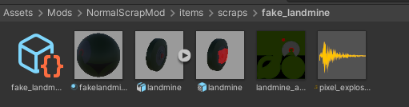
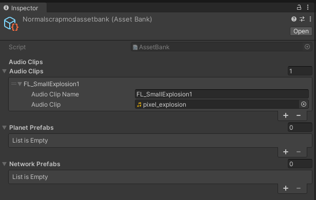
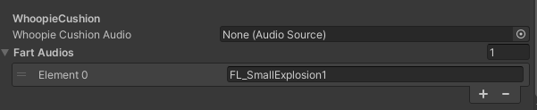
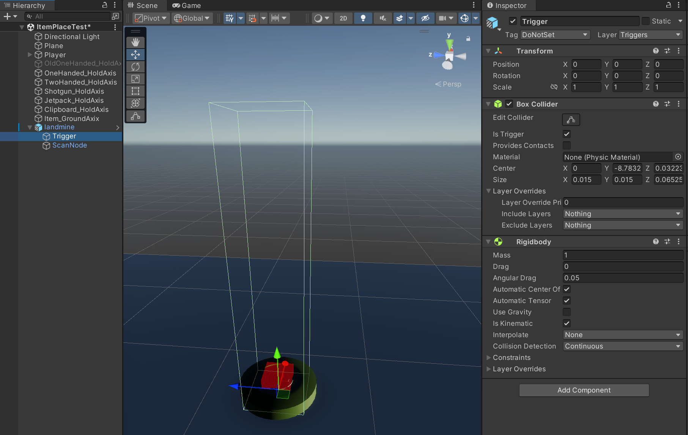

# Whoopie Cushion Scrap Type Guide

This guide is for making `Whoopie Cushion` Type Scrap, which is a Scrap Type that allows the player the step on the Scrap and have a random sound play.

Like in previous guides if you haven't done [NormalScrapType.md](https://github.com/BuffMage/LethalExpansionGuides/blob/main/ScrapGuides/NormalScrapType.md), then please complete that first as making your `Whoopie Cushion` Scrap is not all that different from the Normal Scrap Type.

For this guide we will be making a fake landmine using the following [assets](../Assets/landmine_assets.zip). You can use these if you like, or you can use your own models and sounds.

## 1. Importing your Sounds

Import your sounds by dragging them into your folder containing the scrap you want to be a Whoopie Cushion. At this point, your scrap folder should look like this if you've also followed along with the Normal Scrap Type guide.

## 2. Adding your sounds to the AssetBank

To add your sounds to your Asset Bank, go to your `AssetBank` asset and press the arrow to expand the `AudioClips` list.

Now click `+` to add a new sound file asset.

Add a unique name for your sound and then press on the circle icon to add your sound.

> [!NOTE]
> Unique in this case means it should be easily discernable from other names that people might use, since if two sound assets have the same name in different mods, LethalExpansion might only load one of them and your sound might not play correctly

## 3. Adding your sounds to your Scrap

Now go to your Scrap (Where you change the properties)

In your item properties, change the Scrap Type from `Normal` to `Whoopie Cushion` This will make your scrap act as a Whoopie Cushion.

Once you have done that, scroll down until you find `Whoopie Cushion` then go to `Fart Audios`. This is the list of sounds that will play randomly whenever you step on the scrap.

If you don't want the default fart sounds to play, you can go ahead and remove them now.

Now you can press the `+` icon and type in the name you gave in your `AssetBank` asset.

## 4. Modifying the Prefab

In order for the `Whoopie Cushion` to properly trigger, we need to first make some adjustments to the prefab for our scrap.

The changes we need to make are as follows:
1. Add a new empty GameObject named `Trigger` to your scrap
2. Set the `Tag` to `DoNotSet`
3. Set the `Layer` to `Triggers`
4. Add a `BoxCollider`
   1. Adjust the collider so that its fairly tall, this is to make sure the player's collider actually triggers to play the sound
   2. Check `Is Trigger`
5. Add a `Rigidbody`
   1. Uncheck `Use Gravity`
   2. Check `Is Kinematic`
   3. Change `Collision Detection` to `Continuous`

Once you have finished all of that, your scrap should look similar to this:

## Export

The process for exporting is the same as the Normal Scrap type, which you can follow [here](../ScrapGuides/NormalScrapType.md#7-bundling-your-mod).
